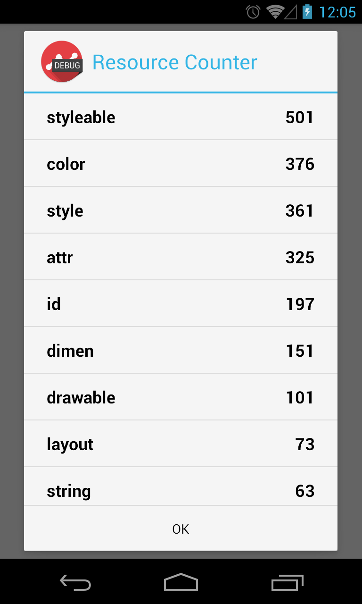
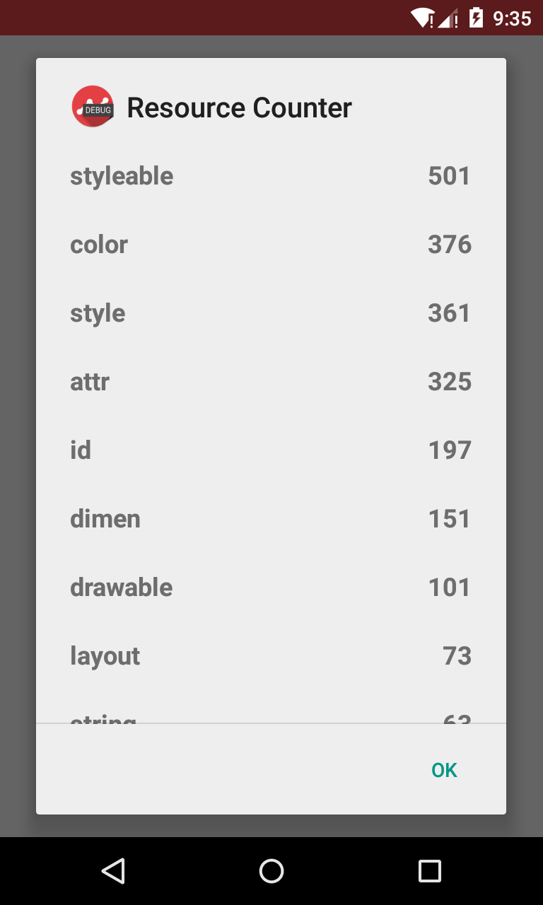

[](https://jitpack.io/#com.github.oriley-me/resourcecounter)
[](http://www.apache.org/licenses/LICENSE-2.0)


# ResourceCounter


Simple library to display the number of resources in your application, grouped by type. As the Android platform has a
limit of 65,535 resources of any individual type, I found it interesting to see what the typical counts are, and
whether any of my applications come close to breaching this limit. As of yet, they've all been well and truly below,
but it doesn't hurt to be safe.

If you do have any with extremely high counts, I'd love to hear about it!


## Usage


The usage is extremely simple. just add the following line wherever you would like the dialog to be displayed:

```java
ResourceCounter.showResourceCounts(this, R.class);
```

This will calculate all the resource counts, and show you a dialog such as the following:


 


## Gradle Dependency


1. Add JitPack.io to your repositories list in the root projects build.gradle:

```gradle
repositories {
    maven { url "https://jitpack.io" }
}
```

2. Add the following to your module dependencies:

```gradle
dependencies {
    compile 'com.github.oriley-me:resourcecounter:0.1'
}
```
